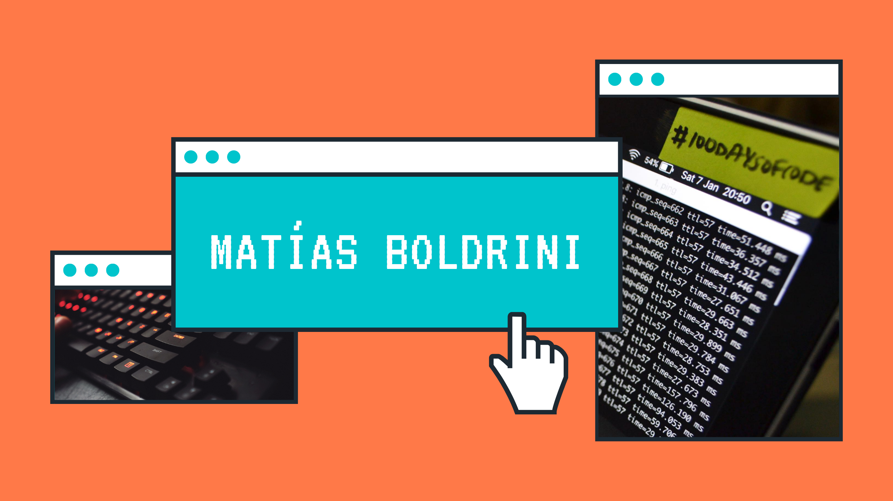

## Hola, Soy Matías! 👋
### Soy un  estudiante de Ingeniería en sistemas, y un programador aficionado!
- 🔭 Actualmente trabajo en un proyecto presonal con Unity e IA!
- 🌱 Me gusta aprender de todo 🤣
- 🥅 Objetivo 2021: Subir Mi primera app a playstore
- ⚡ Hobbies: Jugar Videojuegos, Programar, Mountain Biking.

### Mis redes Sociales

[][youtube]
[][linkedin]
[][instagram]

 

### Lenguajes y Herramientas:

[][youtube]
[][youtube]
[][youtube]
[][youtube]
[][youtube]
[][youtube]
[][youtube]
[][youtube]

[][youtube]

[][youtube]

 
 

---

[website]: https://www.youtube.com/channel/UChnXf3O49gMiyDc_RhVcP7w
[youtube]: https://www.youtube.com/channel/UChnXf3O49gMiyDc_RhVcP7w
[instagram]: https://www.instagram.com/matibol_16/?hl=es-la
[linkedin]: https://www.linkedin.com/in/matías-boldrini-93b146192
